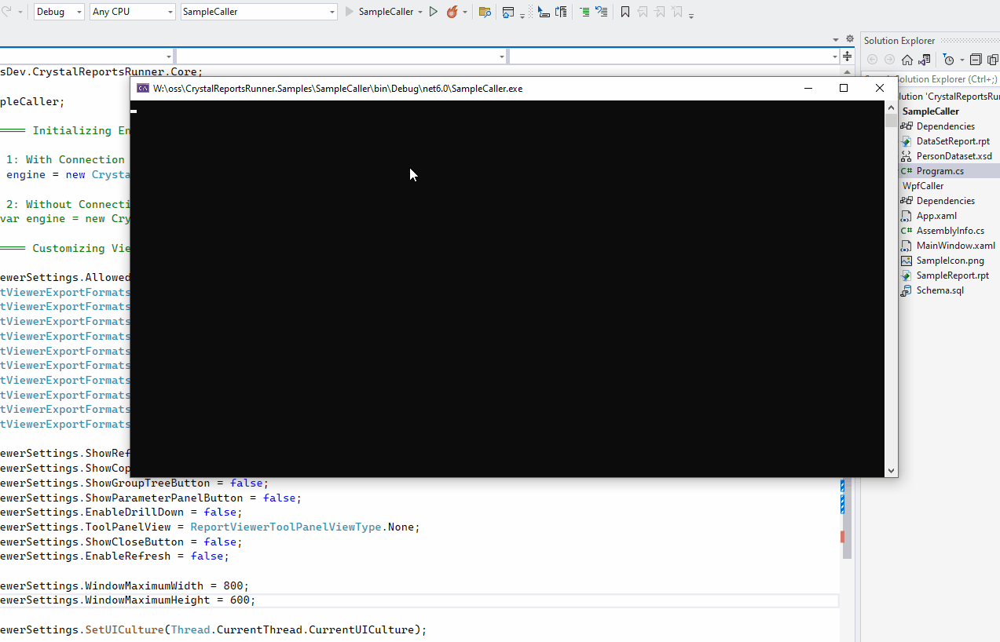
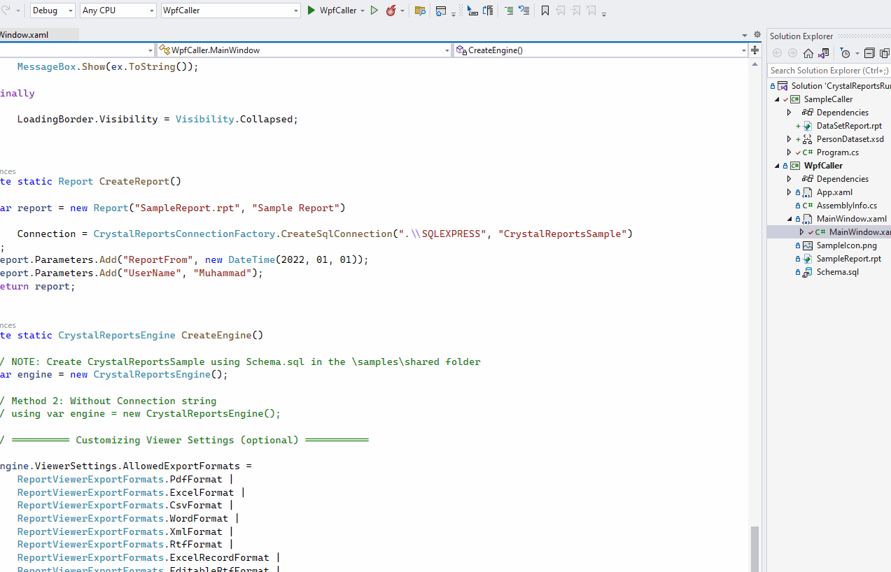

# CrystalReportsRunner.Samples
Sample .NET6 apps using Crystal Reports Runner NuGet packages. For more information and documentation please refer to the [main repo](https://github.com/gerardo-lijs/CrystalReportsRunner). Please note that:

- You'll need .NET Framework 4.8 for the runners to work.
- The samples reference v13.0.32 x64 of Crystal Reports, if you're using a different version change the referenced NuGet package.

## Samples

### Sample Caller

A Console Application targeting .NET 6 that sends a dataset to a report and shows it. **This doesn't require a database connection.**

### WPF Caller

A WPF app targeting .NET 6 that demonstrates showing and exporting of reports using the library. Requires you to create a database using [The provided schema file](./WpfCaller/Schema.sql).

